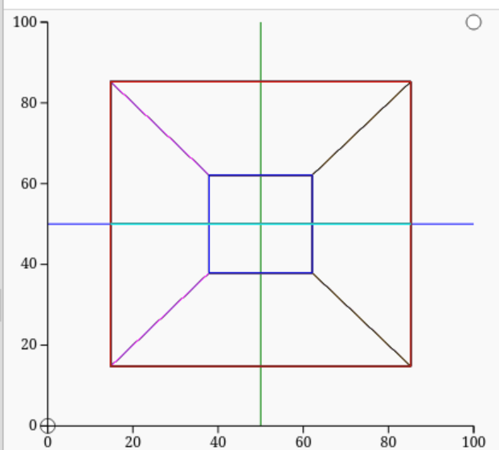
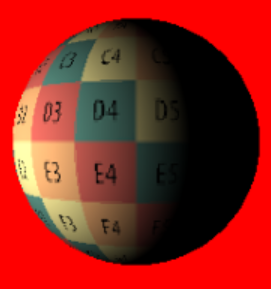
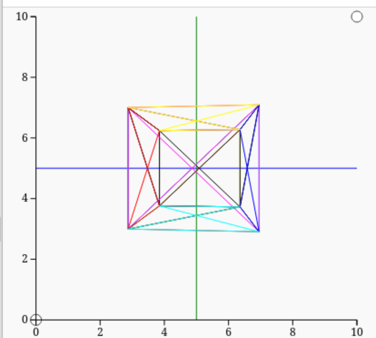
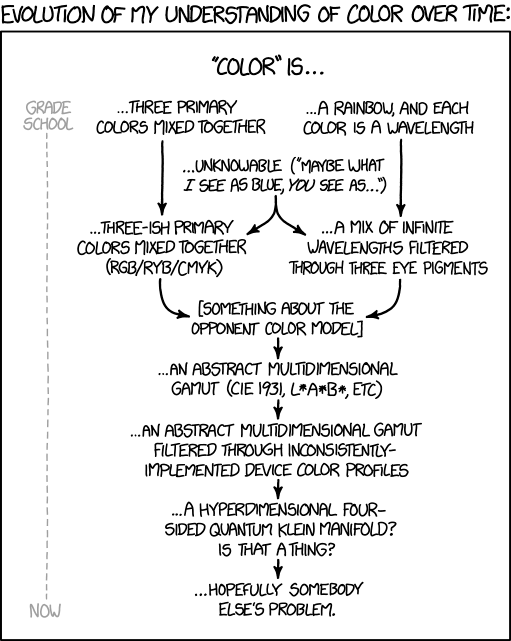

Welcome to the third iteration of my ray tracing journey!


# About This Version
This iteration of my rendering project marks V3 of what I have version controlled. This version is the first written in a compiled language, and leverages the mature software design habits I've acquired to focus on efficiency and physical accuracy for the first time.

## efficiency
This is far from a resource efficient implementation. As it's software based, it will never come close to what a GPU can offer, even with recently implemented concurrency. I'm planning on taking advantage of various acceleration structures, and SIMD in the future, but don't have hopes that this will ever be as performant as is possible today.

## physical accuracy
I've taken heavy inspiration from the book *Physically Based Rendering: from theory to implementation* for this implementation. The objective for this iteration of the project is to use as rigorous a definition as possible for all values being computed. I have to say, it's weird using the Boltzmann constant in a renderer, but I have my goals.


# History
After first starting with graphic programming as a freshman in high school, the field has followed me around ever since. As I write these words in early 2025, I've spent the better part of a decade thinking about how images are created with math.

The catalyst for this undertaking was a conversation I had in the summer of 2018 with a friend about how foreshortening worked. I had an on and off relationship with Python by that point, I was doing all my "coding" using MIT's Scratch. I really wanted to draw polygons in space.

I bit the bullet and learned how to actually program as I started High School that year.
I have fond memories of fighting IDLE on my Rasbperry Pi staring up at the TV I was using as a monitor on the floor.

That Spring term, at 15 I got a real computer for the first time, and for some reason I decided to use a web based IDE? Trinket was terrible and made me use Python 2, but I was able to write the first version of this project, foreshorting a cube and animating it in space.



Learning modelling software in the Spring of 2019 only intensified this desire, now I was regularly working with computer generated imagery, but was still as a complete loss as to how it all worked.

It's all kind of unclear what happened when, but sometime between that first version and Spring 2022 when I started using version control, ray tracing became my goal. I implemented ray sphere intersection, texture mapping, Lambert's law weakening, and recursive ray propagation. That iteration ended with the realization I needed a more robust codebase to implement the features I wanted to, I didn't know what I was doing was called linear algebra at that point, and I was trying to do light propagation in RGB, without any understanding of what that meant.




## transition to git&github, and a real IDE
There was a distinct moment I remember knowing I needed to switch to using actual tooling. I had spent the day working in the Trinket web IDE, only to open up an outdated version of the page on my pc, and watch the days work be overwritten. I learned firsthand why people use version control systems, and dedicated myself to learning the necessary tooling for the project at hand. I remember how freeing it felt to actually be able to write multiple modules for the first time, rather than putting everything in one script. That was Spring of 2022, and I've been using real tools since.

## V1
March of that year I rewrote the codebase into Graphics_V1 to take advantage of the new tooling I was using, splitting everything up into modules for the first time. That small iteration saw me implement an .OBJ loader for the first time, and was the only iteration had the ability to move around. It was limited to wireframe renders, but served as a good proof of concept for what followed. That codebase can be found at [here](https://github.com/12to-the12/graphics-depreciated)

## V2
The second real iteration of this project was a maturation of how I write code. I started using typechecking for the first time, as well as unittesting. Even so, I found myself dissatisfied with the way Python worked, even using JIt compilation, I knew I could write something faster if it was closer to the metal. That codebase can be found at [here](https://github.com/12to-the12/graphics)

## V3 and here we find ourselves.
This version find me focused on building a ray tracer that is as physically accurate as possible. I subscribe to the philosophy that you need a solid foundation to build anything of value, and I don't feel it's sufficient to hand wave anything away. This comes at the cost of performance, but by now I've come to the conclusion that that comes second.


# Scholastic Value
This endeavor has been responsible for driving a lot of my personal education. It was the catalyst that originally drove me to learn how to actually program, rather that stick with MIT's Scratch. It's driven me to learn a real systems language as well, now with Rust.

## intersection algorithms and linear algebra
As soon as ray tracing became my goal, I need to learn how to trace rays! Sphere ray intersection and ray polygon were the first non trivial linear algebra that I had to learn in order to implement the features I wanted to.
[This](https://www.youtube.com/playlist?list=PLW3Zl3wyJwWN6V7IEb2BojFYOlgpryp1-) is the youtube playlist that taught be these algorithms.

## rotational composition and transformation matrices
When I started this journey with just a wireframe rendered using pygame, I was unaware that rotations could not be summed together linearly. I was encoding rotations using polar coordinates, as well as projected points in space using equally spaced angles rather than a viewing frustrum. These techniques caused a lot of issues, and necessitated I learn the fundamentals of linear algebra.



A lot of reading later and I had my answers.
The rotation problem was better solved by encoding tranforms as a vector and an angle.
I also learned that transformations could be expressed as matrices and composed together without being applied, meaning that only one matrix had to be applied per transformation.
This was massive, and really interesting to me.

I also learned about the difference between object space, world space, camera space, and raster space; and why you want to encode values using different coordinate spaces. Using matrix composition, transforming location vectors between these is as simple as applying a transform matrix.

## light and color



The first time I tried implementing specular highlights I failed miserably. Turns out light and color are complicated. I was familiar with the BSDF from Blender, but I didn't know exactly how to implement it.

This project motivated me to learn about the ridiculous intricacy of color, I'd recommend [this](https://www.youtube.com/watch?v=gnUYoQ1pwes) amazing explanation about how human vision interprets electromagnetic radiation, how we can represent it using vector spaces, and how we can record and display it using technology.

*Physically Based Rendering: from theory to implementation* has taught me about the necessity of using proper radiometric dimensionality to record light propagation. Dimensional analysis dives me a headache, but I now know what a steradian is and how it relates to Radiant Intensity.


## Latex and notetaking techniques
As part of my commitment to knowledge management I've started keeping a companion set of notes on the techniques I've acquired building this project. In the past, the moment I stepped away from something, the entire prerequisite knowledge base left my mind, and I found myself starting anew every time. As we all know, source code is NOT self documenting, and that's even more true for the actual paradigms the algorithms implement. I learned the fundamentals of LaTeX to properly record and formalize the math I was learning, as well as mermaid diagramming syntax.


# Installation & Running
If you're running this yourself, good luck, I've tried to make it as portable as possible.

## dependencies
To run this project you need to have Rust installed and visible on your path

## running
Clone the project with
```bash
git clone https://github.com/12to-the12/graphics_v3.git
```

cd into the folder and and run the project with
```
make
```

the renderer outputs the result as a png in the project root, that was simpler than trying to interface with a windowing system.

# Roadmap
- [x] ray/polygon intersection
- [x] matrix based tranformations
- [x] .obj import
- [x] Lambert's law falloff
- [x] Spectra based light propagation
- [x] concurrency
- [ ] full physically based lighting model
- [ ] spatial acceleration structures